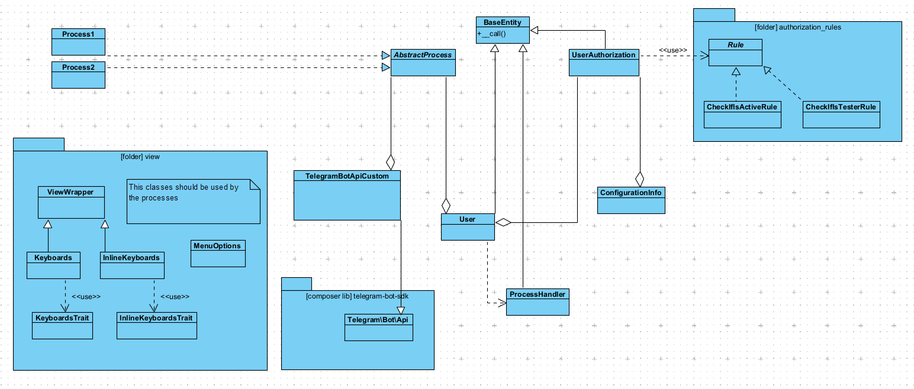

(Sorry for my not perfect english)

<!-- omit in toc -->
# What is this?
This is a set of folders and classes to start a generic Telegram bot project.
<br>

<!-- omit in toc -->
# Documentation
The code is commented a lot, so the information about every specific class is into the code. Here I will describe only some parts of the project.

This is a UML diagram that explain the structure of the classes:



**Index of paragraphs**:
<!-- TOC start -->

- [Folder structure](#folder-structure)
- [Code style](#code-style)
- [Libraries installed](#libraries-installed)
  - [Class `TelegramBotApiCustom`](#class-telegrambotapicustom)
- [List of all example classes or editable classes](#list-of-all-example-classes-or-editable-classes)
- [Autoloaders](#autoloaders)
- [Class `ConfigurationInfo`](#class-configurationinfo)
- [The `hook.php` file](#the-hookphp-file)
- [Authorization rules](#authorization-rules)
- [Class `BaseEntity`](#class-baseentity)
- [Classes of `view/` folder](#classes-of-view-folder)
- [About processes](#about-processes)

<!-- TOC end -->
<br>

<!-- TOC --><a name="folder-structure"></a>
## Folder structure
For the structure i've been ispirated to the MVC architecture logic.<br>

`config/` contain configuration files and classes to handle it;<br>
`control/` contain classes that handles the processes of the bot;<br>
`docs/` contain some useful documents about the project;<br>
`entities/` contain classes that comunicate with external services (like APIs or a database), or classes that implements some specific objects;<br>
`exceptions/` contain custom exceptions;<br>
`logs/` folder to store logs (need to be setted by the server as a default class);<br>
`vendor/` contain [Composer](https://getcomposer.org/)'s downloaded libraries;<br>
`view/` contain classes to handle the messages shown to the final user on the bot and everithing about the "UI" of the bot (messages, emoticons, buttons. ecc...);<br>

You can see the folders `entities/`, `view/` and `control/processes/` as the MVC folders.
<br>

<!-- TOC --><a name="code-style"></a>
## Code style
The coding style followed in the classes of this project (except the external library classes) is the following:

| Type of variable            | Style               |
| --------------------------- | ------------------- |
| **Class instance variable** | \$_InstanceName     |
| **Class definition**        | ClassName           |
| **Attribute or variable**   | snake_case_variable |
| **Method of function**      | camelCaseFunction   |
| **Constants**               | CONSTANT_NAME       |

<!-- TOC --><a name="libraries-installed"></a>
## Libraries installed
In this example base project I've installed two libraries:
- [telegram-bot-sdk](https://github.com/irazasyed/telegram-bot-sdk): an unofficial Telegram bot API SDK
- [meekrodb](https://github.com/SergeyTsalkov/meekrodb): a simple library to handle database MySQL calls

You can change this libraries with others with the same scope (interface with telegam bot api methods and interface with database), but I recommend anyway to use some library to handle this two fundamental aspect of the structure.

<!-- TOC --><a name="class-telegrambotapicustom"></a>
### Class `TelegramBotApiCustom`
Into `entities/tgbotapi_custom_interface/` folder I've created this class that extends the `Telegram\Bot\Api` class of the `telegram-bot-sdk` library. Obviously it's a fairly personal modification based on my more general needs.
<br>

<!-- TOC --><a name="list-of-all-example-classes-or-editable-classes"></a>
## List of all example classes or editable classes
You can delete:
- `control/processes/Main.php`: I recommend you to modify this class and don't delete it. Every bot need a Main process (ideally, the main menu);
- `control/processes/firstpath/SameNameClass.php` and `control/processes/secondpath/SameNameClass.php`;
- `entities/authorization_rules/CheckIfIsActiveRule.php` and `entities/authorization_rules/CheckIfIsTesterRule.php`;

You can modify:
- `entities/tgbotapi_custom_interface/`: you can modify and personalize all classes;
- `entities/ProcessHandler.php`: you should modify the methods based on your database structure;
- `entities/User.php`; you should modify the costructor and the attributes based on your database structure;
- `hook.php`
  
Remind that when you modify `User` and `TelegramBotApiCustom` classes you need to check the `AbstractProcess` class, that use them as aggregate classes.

In general when you want to make some modification take a look to the UML diagram.
<br>

<!-- TOC --><a name="autoloaders"></a>
## Autoloaders
There are three autoloaders in this project, that you must call at the beginning of the webhook file (`hook.php`, in this example):
- `vendor/autoload.php` is the one that upload the Composer's libraries;
- `/project_autoloader.php` is the one that upload all the classes of the project.<br> The project must respect the [PSR-4 standard](https://www.php-fig.org/psr/psr-4/) (in the definition of the namespaces, for example) to make the autoloader work. The `Psr4AutoloaderClass` is the class to handle the definition of the standard autoloader.
- `control/processes_autoloader.php` is the one to upload the classes of processes, handled differently from the others. [In this file](control/processes.md) I explain why it has to be different.

With this three autoloaders every class will be uploaded automatically during the run-time.
<br>

<!-- TOC --><a name="class-configurationinfo"></a>
## Class `ConfigurationInfo`
The `ConfigurationInfo` class is a [singleton class](https://en.wikipedia.org/wiki/Singleton_pattern) tho handle the info into the file `config.json`.<br>
You can change the `config.json` file as you wish and write the class methods accordingly.<br>

In my personal `config.json` file there are two identical set of attributes, but one is for testing and develop time and the other one is for production time.<br>

```json
{
  "testing": {
    "TELEGRAM_BOT_API_TOKEN":"tokentousewhiledeveloping"
    // (...)
  },
  "production": {
    "TELEGRAM_BOT_API_TOKEN":"tokentouseinproduction"
    // (...)
  }
}
```
With this configuration you can set two different environments that changes when you change a simple parameter into the `ConfigurationInfo` class call:
```php
// Static method of singleton ConfigurationInfo class
public static function setInstance(bool $testing=false) {...}
```
```php
// ConfigurationInfo instance in hook.php

// if you want to act in testing environment -->
$_SystemConfig = ConfigurationInfo::setInstance(true);
// if you want to act in production environment -->
$_SystemConfig = ConfigurationInfo::setInstance();
```
<br>

<!-- TOC --><a name="the-hookphp-file"></a>
## The `hook.php` file
This file is an example of a standard file to be used as "access point" of the Telegram bot requests. The URL of this file should be setted as webhook of the Telegram bot.
<br>

<!-- TOC --><a name="authorization-rules"></a>
## Authorization rules
Into the `entities/authorization_rules/` folder there are the rules. What are the rules?<br>
When a Telegram user send messages to the bot it might be useful to check some properties, for example if he is able to access or his legal permit has expired.

For each of there properties you can create a new class that extends `Rule` (as, in the example, `CheckIfIsActiveRule` and `CheckIfIsTesterRule`) and define the `rule()` method, as in the example below.<br>
```php
// (for example) The bot can be used only from users activated from the admin
class CheckIfIsActiveRule extends Rule {

  public function rule() {
    if ($this->getUser()->isActive()) {
      return true;
    }
    return false;
  }

}
```

Then you have to add the instances of the classes you've created into the `private function rulesToAdd()`, into the `UserAuthorization` class:
```php
private function rulesToAdd() {
  $this->addRule(new CheckIfIsActiveRule($this->getUser(), $this->getSystemConfig()));
  $this->addRule(new CheckIfIsTesterRule($this->getUser(), $this->getSystemConfig()));
}
```
The `UserAuthorization` class method `verifyAuthorization()` execute the `rule()` method of every instance you have added into `rulesToAdd()` method. So you can verify all the necessary rules and also get specific error messages for each one, in case some doesn't pass the check.
<br>

<!-- TOC --><a name="class-baseentity"></a>
## Class `BaseEntity`
This class, by its `__call` magic method, provides the getters and setters of every attribute into the subclasses. Every new "entity" class should extend this class.
<br>

<!-- TOC --><a name="classes-of-view-folder"></a>
## Classes of `view/` folder
The `MenuOptions` class is a class of constants only, which represent the bot's static commands. The constants should be the keys of the array `$valid_static_inputs` in each process class (depending on the class).
```php
// (into MenuOption class)
  public const COMMAND_START = '/start';
  public const COMMAND_RESTART = '/restartbot';
```
```php
// (into a process class)
  protected array $valid_static_inputs = [
    view\MenuOptions::COMMAND_START => "startProcedure",
    view\MenuOptions::COMMAND_RESTART => "restartProcedure"
  ];
```
<br>

The `ViewWrapper` class is similar to `BaseEntity` class. This class has a defined `__callStatic` magic method which, for every "get" static call of the sub-classes (`Keyboards` and `InlineKeyboards`), return the formatted buttons to set as argument into `reply_markup` parameter, into a `sendMessage` request, for example.<br>

The buttons can be defined statically as public constant into the subclasses (is described int the specific classes how).<br>
For `Keyboards` and `InlineKeyboards` are used, respectively, `KeyboardsTrait` and `InlineKeyboardsTrait`, two [traits](https://www.php.net/manual/en/language.oop5.traits.php#:~:text=Traits%20are%20a%20mechanism%20for,living%20in%20different%20class%20hierarchies.) which offer the function to create the keyboard an the inline keyboard from an array:
```php
// (into Keyboards class)
  public const MAIN_MENU = [
    [MenuOptions::COMMAND_START, MenuOptions::COMMAND_RESTART]
  ];
```
```php
// (example of usage)
$_Bot->sendMessage([
  'text' => "==> " . $test,
  'reply_markup' => Keyboards::getMainMenu()
]);
```
<br>

<!-- TOC --><a name="about-processes"></a>
## About processes
An exhaustive description of processes is into [control/processes.md](control/processes.md) file. There is also an article on my blog [here]()
<br>